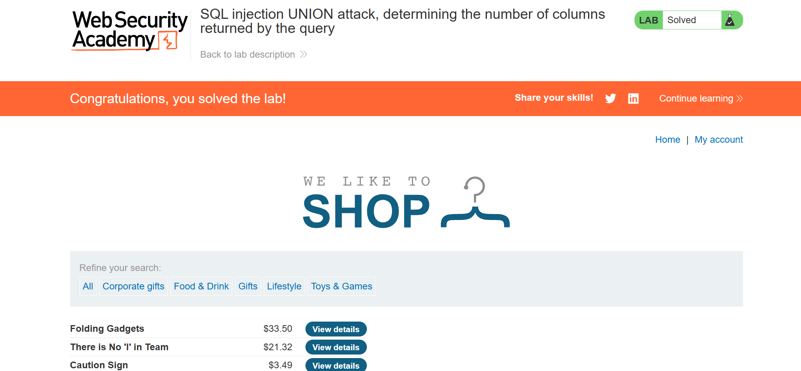
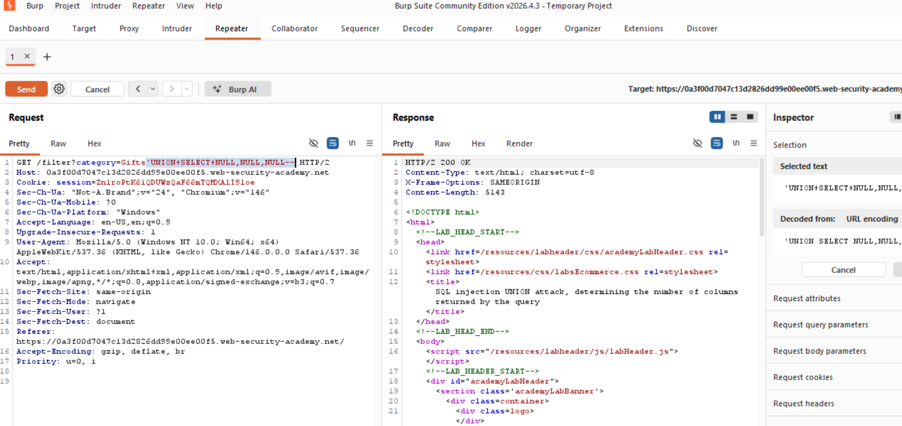
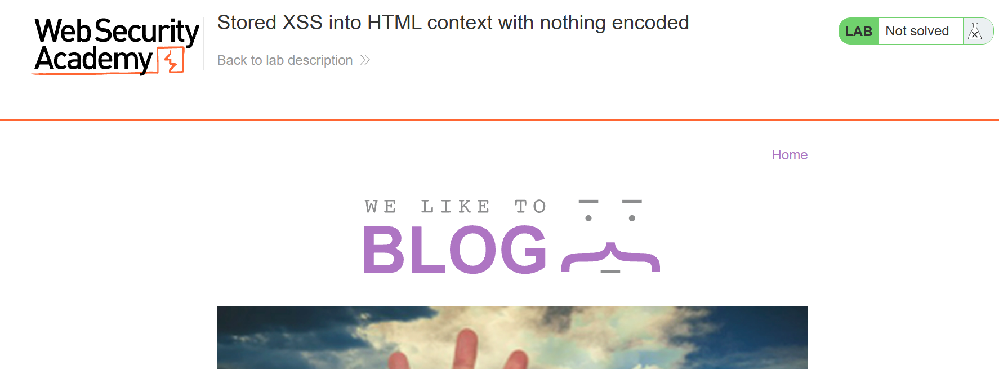
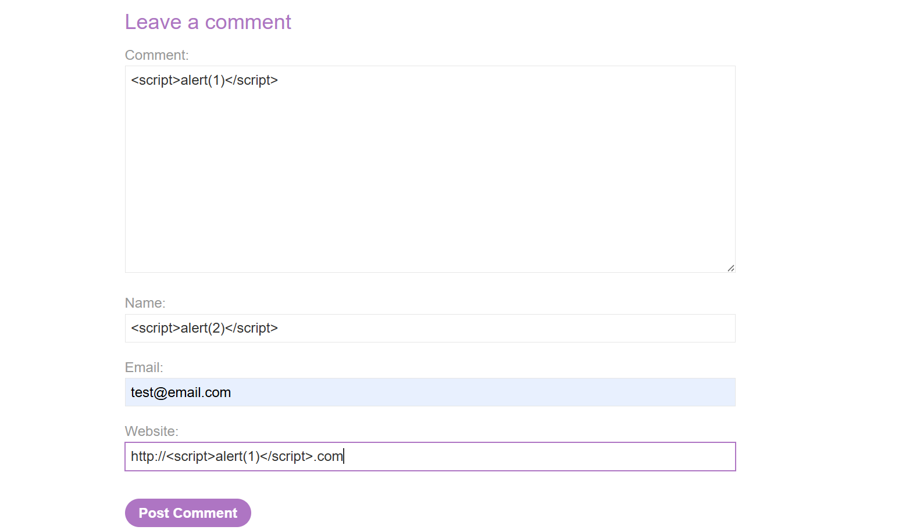
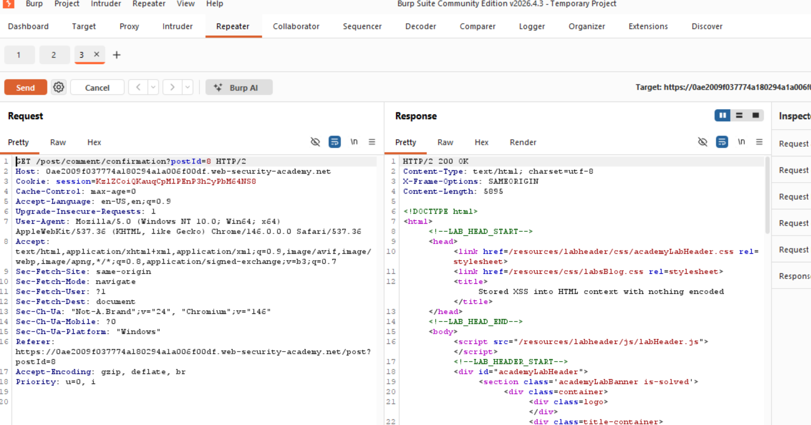
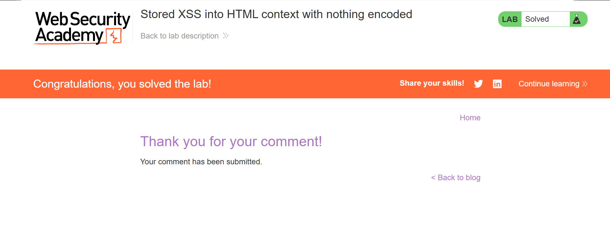
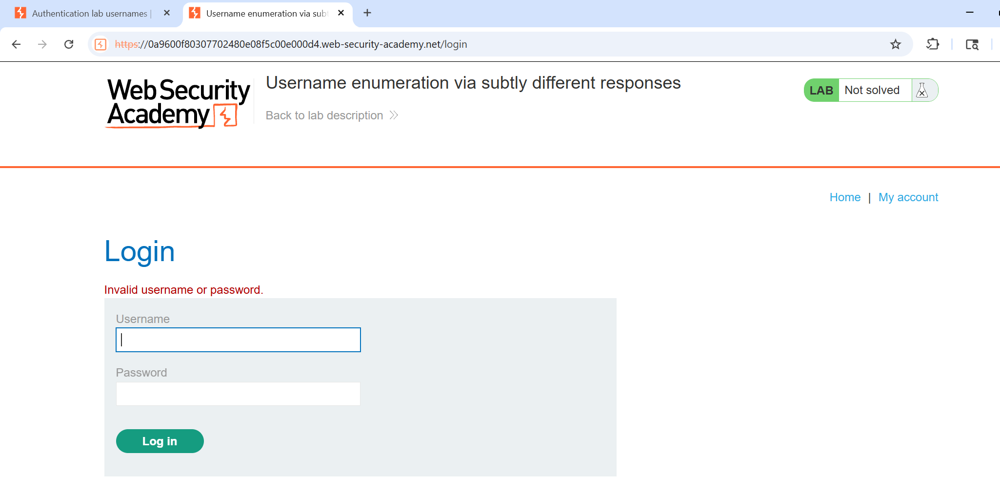
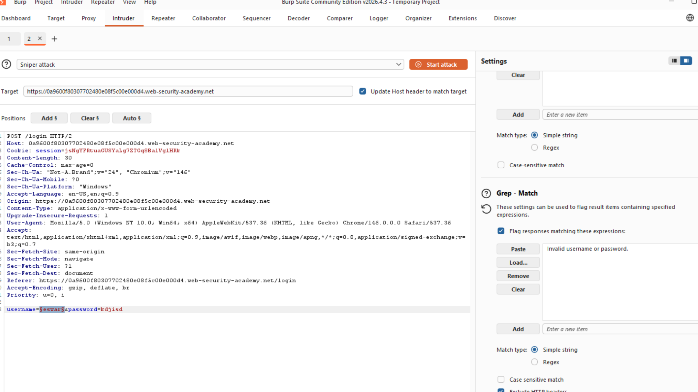
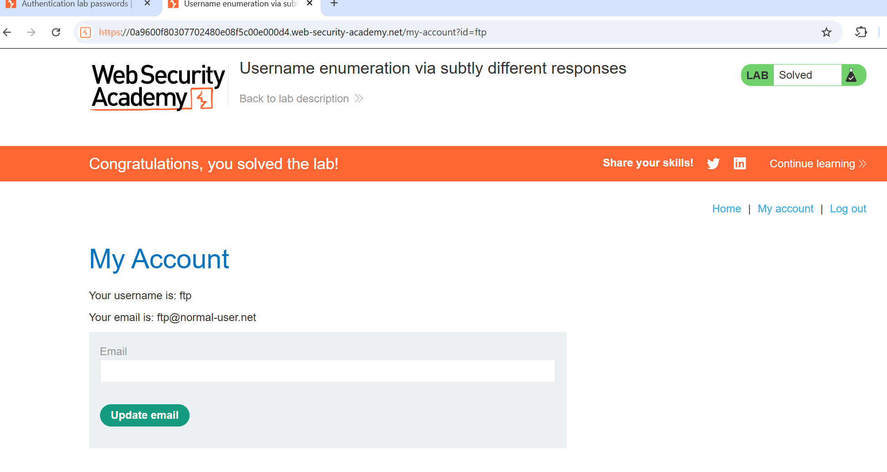

# PortSwigger Web Security Academy Labs

This repository contains my hands-on practice and writeups for web application penetration testing.

## Vulnerabilities Practiced

* SQL Injection
* Cross-Site Scripting (XSS)
* IDOR
* Broken Access Control
* CORS Misconfiguration

## Tools Used

* Burp Suite
* Kali Linux
* OWASP ZAP

## Objective

To improve practical VAPT skills through real-world web application security labs.
## SQL Injection Testing

The screenshot below demonstrates union attack using SQL Injection techniques through Burp Suite.

## Stored XSS into HTML Context with Nothing Encoded

The screenshot below demonstrates successful exploitation of a Stored Cross-Site Scripting (XSS) vulnerability where malicious JavaScript payload was stored by the application and executed automatically in the browser.

## Broken Access Control

The screenshot below demonstrates username enumeration through subtly different authentication responses. Variations in application error messages and response behaviour were analysed to identify valid usernames during login attempts.

